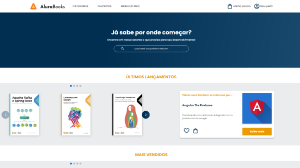

<a id="readme-top"></a>

# **Alura Books**

<!-- PROJECT STATUS -->

> Project Status: ✅ (Concluded)

> Live Code Preview. GitHub Pages: https://preedroos.github.io/alura-books

<br />

<!-- TABLE OF CONTENTS -->

<details>
  <summary>Table of Contents</summary>
  <ol>
    <li>
      <a href="#about-the-project">About The Project</a>
      <ul>
        <li><a href="#built-with">Built With</a></li>
        <li><a href="#functionalities">Functionalities</a></li>
      </ul>
    </li>
    <li>
      <a href="#getting-started">Getting Started</a>
      <ul>
        <li><a href="#prerequisites">Prerequisites</a></li>
        <li><a href="#installation">Installation</a></li>
      </ul>
    </li>
    <li><a href="#contributing">Contributing</a></li>
    <li><a href="#contact">Contact</a></li>
    <li><a href="#acknowledgments">Acknowledgments</a></li>
  </ol>
</details>

<br />

<!-- ABOUT THE PROJECT -->

## **About The Project**

<div align="center">




</div>

I built this page along with HTML e CSS: responsively with mobile-first course by Alura. The project itself has no functionality but to improve my skills with the technologies used. Feel free to clone this project and use for your own purpose. This repository is also a reference for me to compare my evolution down the road.

<!-- BUILT WITH -->

### **Built With**

This page was built using only `HTML`, `CSS` and `JavaScript`. Also, the carrousel was created using `SwiperJS`.

<!-- FUNCTIONALITIES -->

### **Functionalities**

The project itself has no functionality but to improve my skills with the technologies used.

<p align="right">[ <a href="#readme-top">back to top</a> ]</p>

<br />

<!-- GETTING STARTED -->

## **Getting Started**

You can visit the live code preview on top of this README to visualize the site.

OR

To get a local copy and running follow these simple example steps.

### **Prerequisites**

Using git clone you **must have git** on your computer. Otherwise, you can also download these files on repository.

### **Installation**

1. Clone the repo
   ```
   git clone https://github.com/Preedroos/alura-books.git
   ```
2. Open the `index.html` on browser.

<p align="right">[ <a href="#readme-top">back to top</a> ]</p>

<br />

<!-- CONTRIBUTING -->

## **Contributing**

Contributions are what make the open source community such an amazing place to learn, inspire, and create. Any contributions you make are **greatly appreciated**.

If you have a suggestion that would make this better, please fork the repo and create a pull request. You can also simply open an issue with the tag "enhancement".
Don't forget to give the project a star! Thanks again!

1. Fork the Project
2. Create your Feature Branch (`git checkout -b feature/AmazingFeature`)
3. Commit your Changes (`git commit -m 'Add some AmazingFeature'`)
4. Push to the Branch (`git push origin feature/AmazingFeature`)
5. Open a Pull Request

<br />

<!-- CONTACT -->

## **Contact**

Pedro Paulo Fagundes Cabral

- [GitHub](https://github.com/Preedroos)

- [LinkedIn](https://www.linkedin.com/in/pedropfcabral/)

- [Twitter](https://twitter.com/preedroos)

Email: preedroos@gmail.com

Project Link: [Alura Books](https://github.com/Preedros/alura-books)

<p align="right">[ <a href="#readme-top">back to top</a> ]</p>

<br />

<!-- ACKNOWLEDGMENTS -->

## **Acknowledgments**

Some resources that I find helpful and would like to give credit to.

- [HTML e CSS: responsividade com mobile-first](https://cursos.alura.com.br/course/html-css-responsividade-mobile-first)
- [SwiperJs](https://swiperjs.com/)

<p align="right">[ <a href="#readme-top">back to top</a> ]</p>
